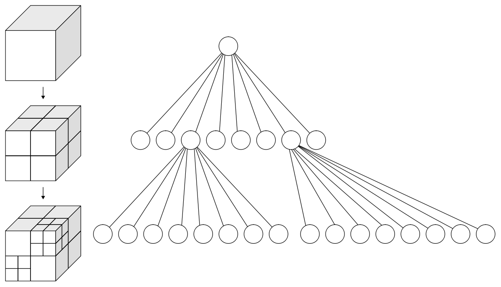
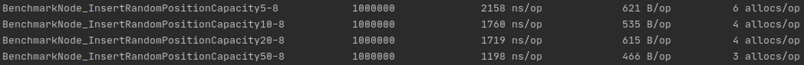
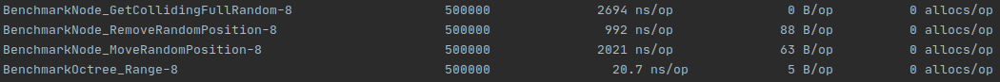

# octree

[](https://app.codacy.com/gh/louis030195/octree?utm_source=github.com&utm_medium=referral&utm_content=louis030195/octree&utm_campaign=Badge_Grade_Dashboard)
[](https://pkg.go.dev/github.com/louis030195/octree)


## Installation

```bash
go get -u github.com/louis030195/octree
```

## Usage

```go
package main

import (
	octree "github.com/louis030195/octree/pkg"
    "github.com/louis030195/protometry/api/volume"
    "log"
)

func main() {
	o := octree.NewOctree(volume.NewBoxMinMax(1, 1, 1, 4, 4, 4))
	myObj := octree.NewObjectCube(0, 2, 2, 3, 0.5)
	ok := o.Insert(*myObj)
	log.Printf("%v", ok) // true
	colliders := o.GetColliding(*volume.NewBoxMinMax(0, 0, 0, 0.9, 2.9, 0.9))
	log.Printf("%v", colliders)              // some objects
	log.Printf("%v", o.Move(myObj, 2, 2, 3)) // Success
	log.Printf("%v", o.Move(myObj, 2, 2, 8)) // Failure: outside tree !
}
```

## Benchmark

```bash
make bench
```




## Roadmap

- [ ] More test coverage
- [ ] Better benchmarks
- [ ] Possible optimisations
    - Linear implementation
    - Looseness
    - Less copies, unnecessary operations
    - Parallelization of a few steps

## References

- [Github storpipfugl/pykdtree: Fast kd-tree implementation in Python](https://github.com/storpipfugl/pykdtree)
- [Github Rust rust-octree](https://github.com/ybyygu/rust-octree)
- [Github JS sparse-octree](https://github.com/vanruesc/sparse-octree)
- [Github Distributed adaptive octree construction, 2:1 balancing & partitioning based on space filling curves](https://github.com/paralab/Dendro-5.01)
- [Github UnityOctree](https://github.com/Nition/UnityOctree)
- [Book: Real-Time Collision Detection - Christer Ericson](https://www.amazon.com/exec/obidos/tg/detail/-/1558607323?tag=realtimecolli-20)
- [AN OVERVIEW OF QUADTREES, OCTREES, AND RELATED HIERARCHICAL DATA STRUCTURES](https://www.cs.umd.edu/~hjs/pubs/Samettfcgc88-ocr.pdf)
- [Efficient Sparse Voxel Octrees](https://research.nvidia.com/publication/efficient-sparse-voxel-octrees)
- [An Efficient Parametric Algorithm for Octree Traversal](http://wscg.zcu.cz/wscg2000/Papers_2000/X31.pdf)
- [O-CNN: Octree-based Convolutional Neural Networks for 3D ShapeAnalysis](https://wang-ps.github.io/O-CNN_files/CNN3D.pdf)
- Behley, J.; Steinhage, V.; Cremers, A. B. Efficient Radius Neighbor Search in
    Three-Dimensional Point Clouds. In 2015 IEEE International Conference on
    Robotics and Automation (ICRA); 2015; pp 3625–3630.
- [scipy.spatial.cKDTree — SciPy Reference Guide](https://docs.scipy.org/doc/scipy/reference/generated/scipy.spatial.cKDTree.html)
- Milinda Fernando, David Neilsen, Hyun Lim, Eric Hirschmann, Hari Sundar, ”Massively Parallel Simulations of Binary Black Hole Intermediate-Mass-Ratio Inspirals” SIAM Journal on Scientific Computing 2019. [Paper](https://doi.org/10.1137/18M1196972)
- Milinda Fernando, David Neilsen, Hari Sundar, ”A scalable framework for Adaptive Computational General Relativity on Heterogeneous Clusters”, (ACM International Conference on Supercomputing, ICS’19)
- Milinda Fernando, Dmitry Duplyakin, and Hari Sundar. 2017. ”Machine and Application Aware Partitioning for Adaptive Mesh Refinement Applications”. In Proceedings of the 26th International Symposium on High-Performance Parallel and Distributed Computing (HPDC ’17). ACM, New York, NY, USA, 231-242. [Paper](https://doi.org/10.1145/3078597.3078610)
